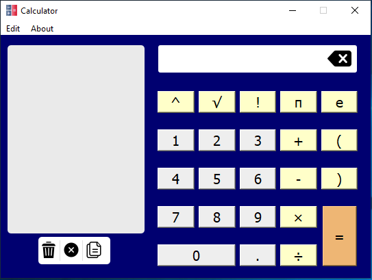

# calculator

This application is a Calculator was generated with PyQt5 and made by Amirreza Tavallaei.

For use this application install PyQt5 module.

For this write this command in Command Line:

```bash
pip install PyQt5 
```

# ScreenShot

</img>


Also this Calculator have a history for see recent operations.
